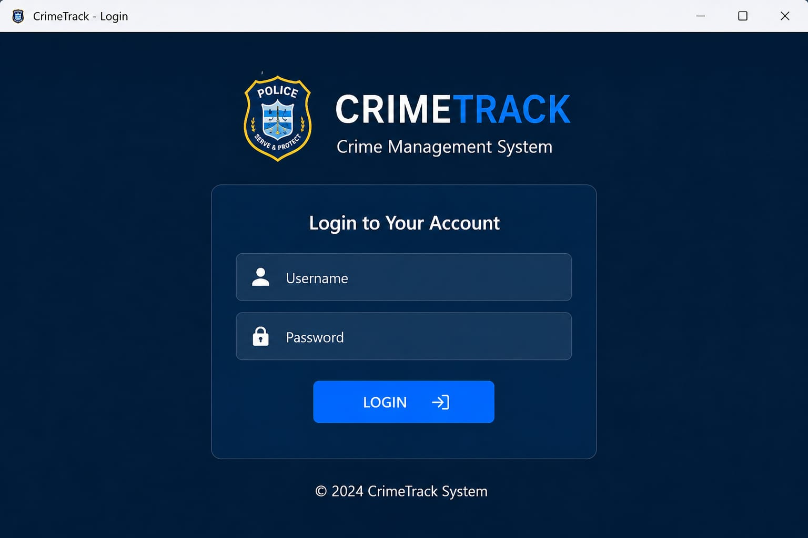
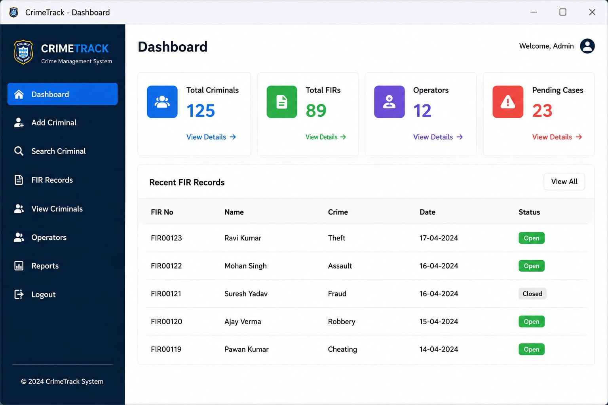

# CrimeTrack---Management---System
JavaFX + JDBC + MySQL + MongoDB Management System 

<p align="center">


</p>

<p align="center">
A modern Police Crime Management System built using <b>JavaFX, JDBC, MySQL, and MongoDB</b> for efficient criminal record and FIR management.
</p>

---

# 🎥 Project Demo

> **Add your demo GIF here after recording your application**

<p align="center">


</p>

---

# 📸 Application Screenshots

## 🔐 Login Screen



---

## 📊 Dashboard



---

## 👤 Add Criminal


---

## 🔎 Search Criminal


---

## 📋 FIR Records


---

## 📑 View Criminals


---

# ✨ Features

| Feature | Description |
|----------|-------------|
| 🔐 Secure Login | User Authentication using JDBC |
| 📊 Dashboard | Live statistics from MySQL |
| 👤 Criminal Management | Add, Update, Delete Criminals |
| 📄 FIR Management | Register & Manage FIR Records |
| 🔎 Search System | Search Criminal using Aadhaar/FIR |
| 🖼 Image Upload | Store Criminal Images |
| 💾 MySQL Database | Relational Database |
| 🍃 MongoDB CRUD | NoSQL Crime Intelligence Module |
| 🎨 JavaFX UI | Modern Police Dashboard |

---

# 🛠 Technologies Used

- Java 17
- JavaFX
- JDBC
- MySQL
- MongoDB
- Eclipse IDE
- CSS
- FXML

---

# 🏗 Project Architecture

```text
                     USER

                      │
                      ▼

            JavaFX Graphical UI

                      │
                      ▼

               Controller Layer

                      │
          ┌───────────┴───────────┐
          ▼                       ▼

      JDBC Layer           MongoDB Driver

          ▼                       ▼

     MySQL Database      MongoDB Database
```

---

# 📂 Project Structure

```text
CrimeTrack-Police-Management-System

│

├── src
│
│   └── com.crimetrack
│
│       ├── MainApp.java
│       ├── DBConnection.java
│       ├── LoginController.java
│       ├── DashboardController.java
│       ├── AddCriminalController.java
│       ├── SearchController.java
│       ├── FIRController.java
│       └── ViewCriminalController.java
│
├── resources
│
│   ├── login.fxml
│   ├── dashboard.fxml
│   ├── addcriminal.fxml
│   ├── search.fxml
│   ├── fir.fxml
│   ├── viewcriminal.fxml
│   ├── style.css
│   └── images
│
├── database
│   └── CrimeTrackDB.sql
│
├── screenshots
│
├── README.md
│
└── LICENSE
```

---

# ⚙ Installation Guide

## 1️⃣ Clone Repository

```bash
git clone https://github.com/pranith-puru/CrimeTrack-Police-Management-System.git
```

---

## 2️⃣ Import Project

Import the project into Eclipse IDE.

---

## 3️⃣ Install JavaFX SDK

Download JavaFX SDK and configure VM arguments.

```
--module-path "C:\javafx-sdk-21\lib"
--add-modules javafx.controls,javafx.fxml
```

---

## 4️⃣ Install MySQL

Create database

```
CrimeTrackDB
```

Execute

```
CrimeTrackDB.sql
```

---

## 5️⃣ Configure JDBC

Update

```
DBConnection.java
```

with your MySQL username and password.

---

## 6️⃣ Run Project

Run

```
MainApp.java
```

---

# 🍃 MongoDB CRUD

The project also demonstrates CRUD operations using MongoDB.

### Create

```
insertOne()
```

### Read

```
find()
```

### Update

```
updateOne()
```

### Delete

```
deleteOne()
```

---

# 📈 Future Enhancements

- AI-based Crime Prediction
- Face Recognition
- Fingerprint Authentication
- CCTV Integration
- PDF Report Generation
- Cloud Database
- REST API
- Mobile Application

---

# 👨‍💻 Developer

**Pranith C Gowda**

BE – Information Science & Engineering

The National Institute of Engineering, Mysore

GitHub:
https://github.com/pranith-puru

---

# ⭐ Support

If you like this project,

⭐ Star this repository

🍴 Fork it

📢 Share it

---

## 📜 License

This project is licensed under the MIT License.
